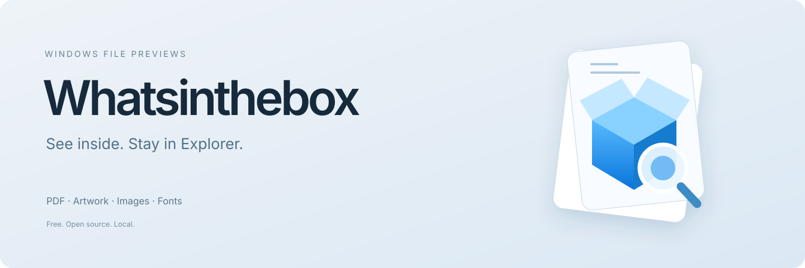
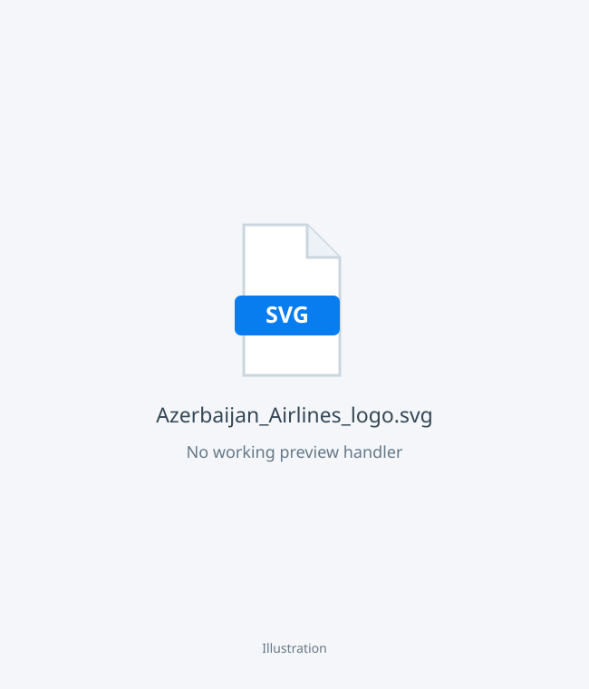
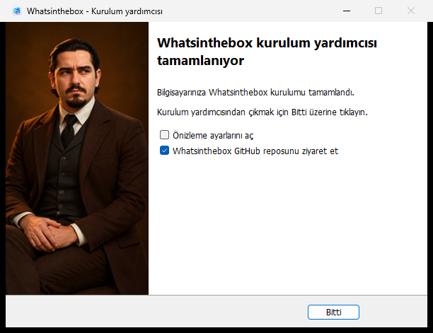

<p align="center"></p>
<p align="center">
 <a href="LICENSE"></a>
 
 <a href="https://github.com/bakhtiyarjahangirzade/Whatsinthebox/actions/workflows/checks.yml"></a>
 <a href="https://github.com/bakhtiyarjahangirzade/Whatsinthebox/releases/tag/v1.0.0"></a>
</p>
<p align="center"><strong>Local file previews, right where your files live.</strong><br>PDFs, artwork, images and fonts. Free and open source.</p>
<p align="center"><a href="https://whatsinthebox-app.vercel.app">Website</a> · <a href="#how-it-works">How it works</a> · <a href="#file-support">File support</a> · <a href="docs/verification.md">Release checks</a> · <a href="CONTRIBUTING.md">Build from source</a></p>

## Release status

**[Download Whatsinthebox 1.0.0 for Windows x64 →](https://github.com/bakhtiyarjahangirzade/Whatsinthebox/releases/download/v1.0.0/Whatsinthebox-1.0.0-Setup.exe)**

One installer, five languages, no separate runtime installation and no administrator requirement. Existing installations offer update or repair; removal restores the handlers that were replaced. The installer is unsigned, so Windows may show a publisher warning. [Verification and checksums →](https://github.com/bakhtiyarjahangirzade/Whatsinthebox/releases/tag/v1.0.0)

## How it works

Select a file in Explorer and press **Alt+P**. View its contents without opening an editor. Thumbnails also appear in folder views and the Details pane.

Original proportions are preserved. Fit enlarges small artwork as well as shrinking large pages. PDF pages have previous/next navigation; transparent artwork has checkerboard, light and dark backgrounds. The app window is only a maintenance panel for language, repair and removal.

### Before → After

The same Azerbaijan Airlines SVG logo, without a working preview handler and with Whatsinthebox:

| Before | After · Whatsinthebox |
|:---:|:---:|
|  |  |
| A filename, no view inside. | See the artwork, with its original proportions. |

The before panel is an illustration; the after image was rendered by Whatsinthebox from the supplied SVG. Existing handlers may already preview some formats. The logo belongs to its respective owner and is used only to illustrate file previews; no affiliation is implied.

## File support

| Files | Preview |
|---|---|
| PDF | Real pages, page navigation and filled form fields |
| PNG, JPEG, WebP, BMP, GIF, TIFF | Images; first frame/page for multi-image files |
| SVG | Vector artwork with external references restricted |
| PSD / PSB | Saved composite image |
| CDR | Saved embedded preview in compatible ZIP-based files |
| TTF / OTF | Font family, specimen and supported characters; no font installation |
| DOCX, XLSX, PPTX, OpenDocument | Text or stored values, not an Office-equivalent layout |
| Text, source code, ZIP / CBZ | Text preview or archive listing |

Password-protected or damaged PDFs, legacy CDR without an embedded preview and unsupported file variants need separate handling. Previewing does not edit your document.

## Installation that understands an existing version

The five-language wizard detects the local version before changing files:

| Local installation | Offered action |
|---|---|
| None | Install |
| Older | Update, or repair and update |
| Same | Repair |
| Newer | Refuse downgrade |

Updates preserve settings. A disabled Windows integration stays deselected. The helper must stop before setup proceeds; busy helpers block installation. Fresh version folders avoid overwriting loaded binaries. Setup does not close Explorer, restart unrelated apps or silently refresh every thumbnail cache.

<p align="center"></p>

The classic wizard uses the author portrait and an optional, initially checked link to this repository. Silent setup does not open a browser. The screenshot is from the five-language 1.0 installer verification.

## Privacy and safety

- Rendering stays on your computer. No document uploads, accounts, advertising or telemetry.
- Explorer loads a small native bridge. Managed rendering and UI run in a separate application process.
- Update checks read public GitHub release metadata; updates are not installed automatically.
- Windows may block downloaded PDFs before invoking the handler. A per-file permission action asks for consent before removing the selected PDF's download mark.
- The renderer has input/time limits and runs separately. It is not a complete OS sandbox, and no scan guarantees zero vulnerabilities.

Read the [security policy](SECURITY.md) and [verification report](docs/verification.md).

## Development

```text
src/        Application, shell integration and shared UI
tests/      Geometry and Windows integration checks
installer/  Inno Setup wizard and lifecycle helper
scripts/    Build and verification commands
website/    Static Vercel website
docs/       Design, dependencies and release verification
```

Open `Whatsinthebox.slnx` with .NET 10 on Windows, or follow [CONTRIBUTING.md](CONTRIBUTING.md). Build outputs stay in ignored `artifacts/`.

## License

[MIT](LICENSE). One license document includes English, Russian, German, Chinese and Turkish information. Third-party license and copyright texts are retained in [NOTICE.txt](NOTICE.txt). See [dependency details](docs/dependencies.md).

Created and maintained by [Bakhtiyar Jahangirzade](https://github.com/bakhtiyarjahangirzade).
