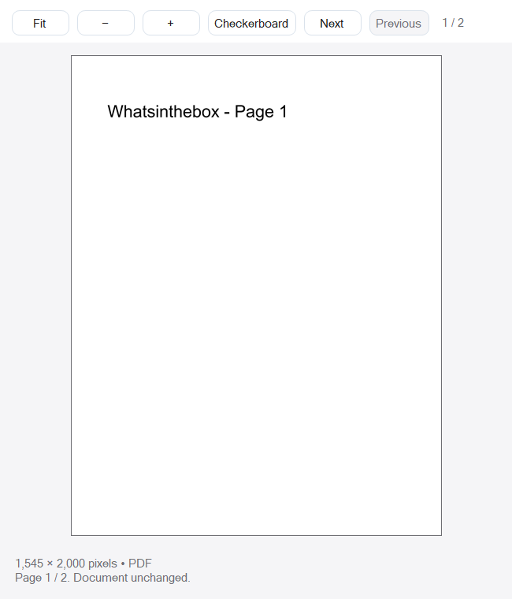
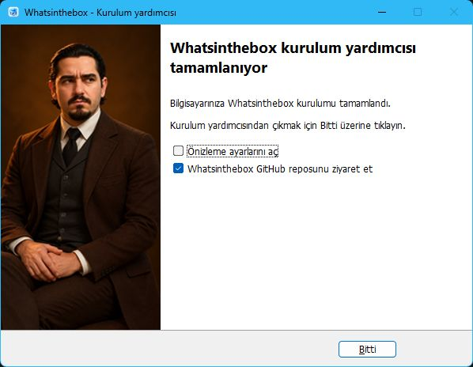
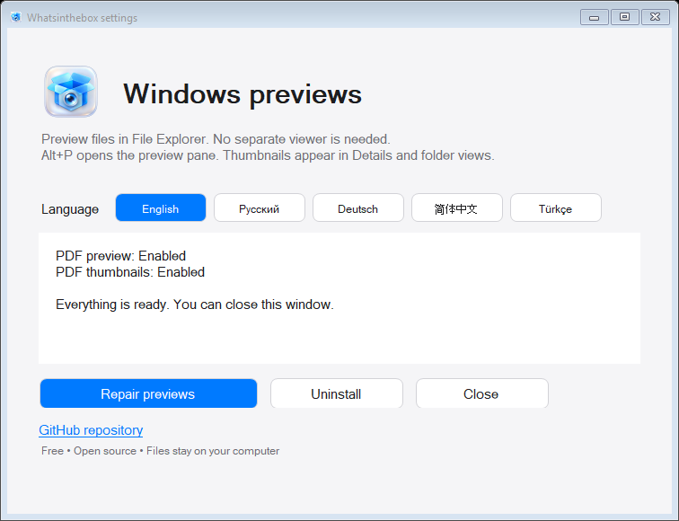
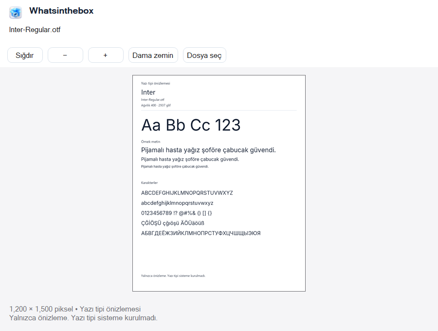
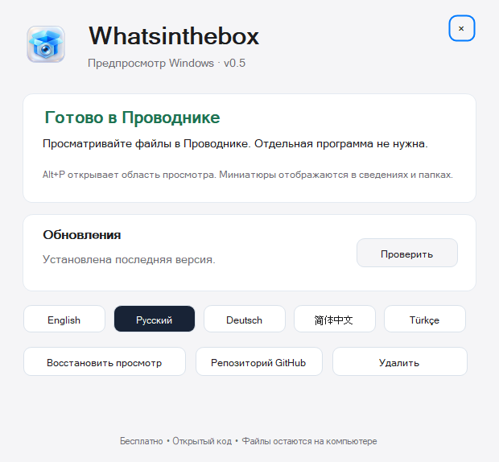
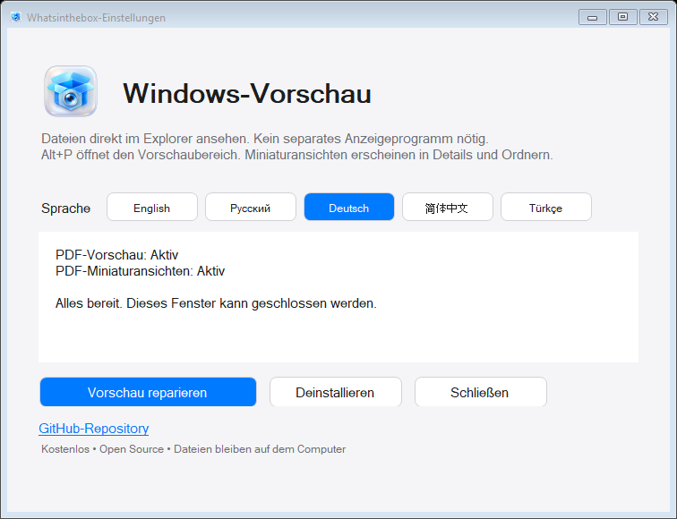
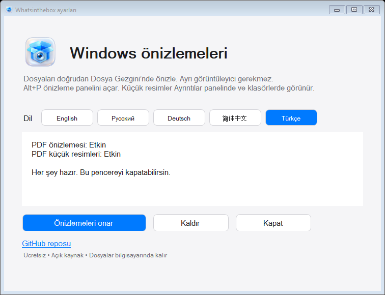

# Whatsinthebox

Free Windows file previews. See inside. Stay in Explorer.

**[Download for Windows](https://bakhtiyarjahangirzade.github.io/Whatsinthebox)** · [Releases](https://github.com/bakhtiyarjahangirzade/Whatsinthebox/releases/tag/v0.6.0) · [Security checks](docs/SECURITY-CHECKS.md)

English · Русский · Deutsch · 简体中文 · Türkçe

## A Windows feature, with almost nothing to manage

Select a file in File Explorer. Use **Alt+P** for a full preview, or see its thumbnail in Details and folder views. Images keep their original proportions; transparent artwork can use a checkerboard, light or dark background. PDFs have page navigation.

No separate file workspace, account, subscription, ads or telemetry. The app checks the public GitHub release list when online, caches automatic checks for 24 hours, and offers a manual check. Updates are downloaded only when you choose to open the release link; nothing installs automatically. A windowless helper starts when you sign in. The only app window is a small maintenance panel for language, repair and removal.

*Actual native preview control captured after Windows out-of-process COM activation with a project-owned PDF fixture. This is an integration test capture, not a screenshot of the entire Explorer window.*

## Install in your language

1. Download **Whatsinthebox-0.6.0-Setup.exe** from Releases.
2. Choose English, Russian, German, Simplified Chinese or Turkish. Setup saves that choice for the feature.
3. Keep Windows integration enabled, then reopen Explorer and press **Alt+P**.
4. The finish page includes an optional, initially checked GitHub repository link. Uncheck it to finish without opening a browser.

The welcome and completion pages use the full-height author portrait.

Installation is per-user. The Microsoft-signed .NET 10 Desktop Runtime x64 installer is included offline and used only if needed for Shell integration. Its shared installation can require administrator approval. Whatsinthebox leaves shared .NET installed on removal.

Remove from Windows Settings → Apps, the Start menu uninstall shortcut, or the maintenance panel. Previous per-user preview handlers and the startup entry are restored; later changes made by another app are preserved. Default file-opening apps are retained.

**Unsigned beta:** this release has no publisher signing certificate. Windows reputation prompts can appear. Security checks are documented; they are not a guarantee that software or every input is risk-free.

## Format support, honestly

| Files | What you see |
|---|---|
| PDF | Real pages, with previous/next navigation. Password-protected PDFs are unsupported. |
| PNG, JPEG, BMP, WebP, GIF, TIFF | Image preview; first frame/page for multi-image files. |
| TTF / OTF | Font family, specimen text and supported characters. Preview only; no font installation. |
| PSD / PSB | Saved composite image. Layer editing is outside scope. |
| CDR | Embedded thumbnail in ZIP-based CorelDRAW files. Legacy binary CDR and files without a saved preview are unsupported. |
| SVG | Static, self-contained vectors. Scripts, DTDs, external references and embedded images are rejected. Safe local CSS is supported. |
| AVIF, HEIC/HEIF, ICO, DDS, TGA, JP2, JXL, EXR and more | Local image codecs; variant support can differ. |
| ORA / KRA | Saved merged image. |
| AI | PDF-compatible content only. No PostScript/EPS rendering. |
| Text, Markdown, JSON, XML, CSV, source code | Paginated read-only text; never executed. |
| DOCX, XLSX, PPTX, ODT/ODS/ODP | Extracted text or saved cell values, rather than original document layout. |
| ZIP / CBZ | File listing, without extracting into your folders. |

See [SupportedFiles.cs](UI/SupportedFiles.cs) for the extension list. Extension registration is not a promise that every variant works. XCF has a decoder but needs more real-world testing. Audio/video playback, camera RAW, old binary Office files and arbitrary formats are outside this version.

## Privacy and safety

Files are decoded locally in a separate worker with a 15-second preview timeout. Limits include 256 MiB input, 8 MiB SVG, 80 million raster pixels and bounded output dimensions. Source files are read-only. Temporary previews are removed on a best-effort basis; a crash can leave local cache files.

ImageMagick delegates and remote/active coders are disabled. Office XML uses bounded reads and never launches Office or executes formulas. The worker is **not an OS security sandbox**. The Shell thumbnail adapter can be loaded by Windows Shell; actual decoding stays in the worker.

[Read the security checks and limitations](docs/SECURITY-CHECKS.md).

## Build

Windows x64, .NET 10 SDK:

    ./build.ps1
    ./dist/runtime/Whatsinthebox.exe --self-test results.json
    dotnet list App/App.csproj package --vulnerable --include-transitive

To build the installer, place the official Microsoft .NET 10 Desktop Runtime x64 installer at ../tools/windowsdesktop-runtime-x64.exe and verify its Microsoft signature. Compile Setup.iss with Inno Setup 6.7.3, for example ISCC /Odist Setup.iss. Check Inno Setup’s current distribution/commercial license terms before commercial use. The project source is MIT; third-party licenses are included separately.

The public build has no QA screenshot automation. Native COM tests live in Tests/. Optional diagnostic captures require a test-capture.flag containing the exact fixture path; no flag ships.

## Contribute

Bug reports with Windows version, file extension and a non-sensitive sample are welcome. Please do not upload private documents. Improvements to format fidelity, translations, accessibility and memory limits are useful first contributions.

Created by [Bakhtiyar Jahangirzade](https://github.com/bakhtiyarjahangirzade). Free and open source, with an original macOS-inspired visual style. Apple assets are not included and this project is not affiliated with Apple.

Русский

Deutsch

简体中文

Türkçe

